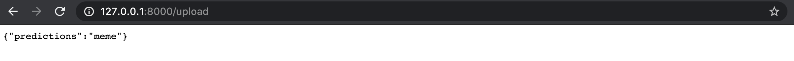

# meme classifier

My first hands-on deep learning classifier using data from `imagenette` and [google images](https://images.google.com) and building a small API of it.

### Sequence of steps followed
- Data collection from `imagenette` and [google images](https://images.google.com)
- Load and Train on raw data with `resnet34` architecture
- Data cleaning by removing similar images and `from_toplosses`
- Unfreeze model and train on cleaned images dataset
- Data Interpretation by `confusion_matrix` and `from_toplosses`
- Comparison with `resnet50` architecture
- Prediction on test set and exporting the trained model
- Building a small API by taking above exported model

### Files
-`meme_classifier.ipynb` : notebook used for performing above steps, using [fastai](https://github.com/fastai/fastai)

-`export.pkl` : Exported model after training (84 MB file)

-`meme_api.py` : A small [Starlette](https://www.starlette.io) API which accepts file upload as well as image URL and runs them against pre-calculated model to give prediction (Couldn't find a way to host in free :stuck_out_tongue_winking_eye:). Usage:

```
uvicorn meme_api:app
```

### Examples
**Input Image (upload):** `data/Unknown.jpg`


**Prediction:**
http://127.0.0.1:8000/upload




**Input Image (URL):** `https://upload.wikimedia.org/wikipedia/commons/thumb/0/04/Greenland_467_%2835130903436%29.jpg/640px-Greenland_467_%2835130903436%29.jpg`


**Prediction:**
http://127.0.0.1:8000/classify-url?url=https%3A%2F%2Fupload.wikimedia.org%2Fwikipedia%2Fcommons%2Fthumb%2F0%2F04%2FGreenland_467_%252835130903436%2529.jpg%2F640px-Greenland_467_%252835130903436%2529.jpg


### References
https://course.fast.ai

https://github.com/fastai/fastai
